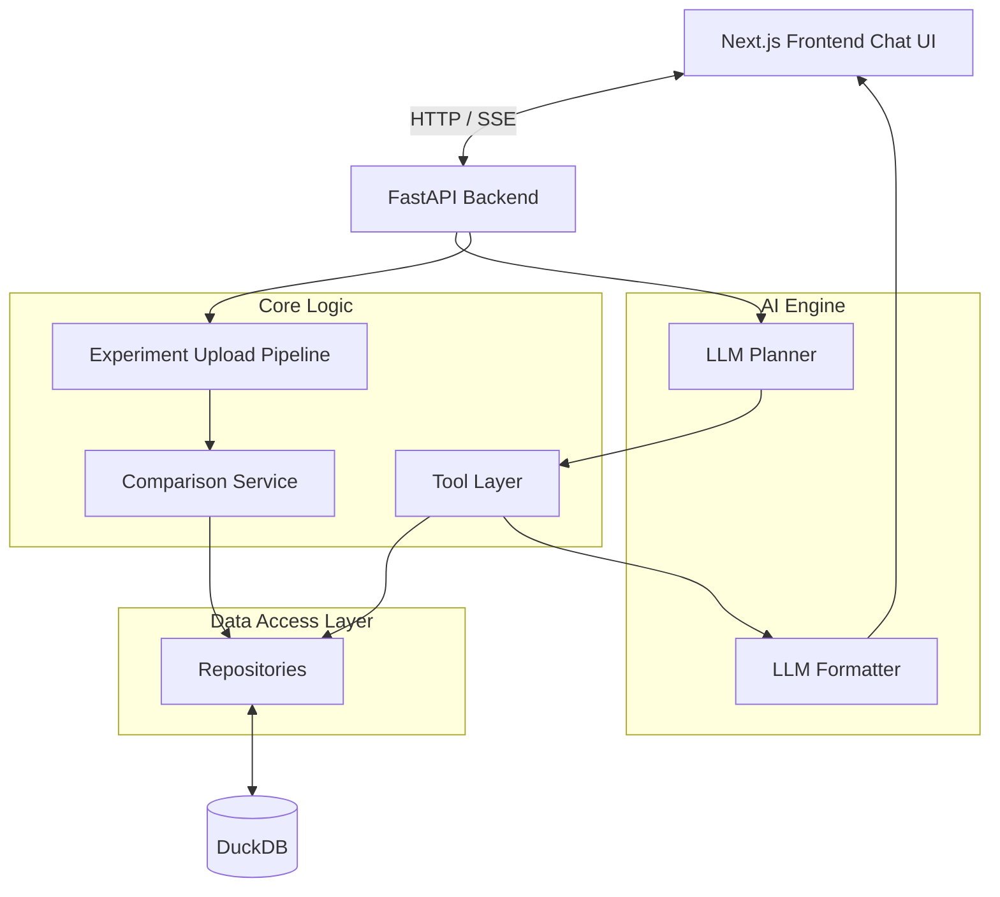
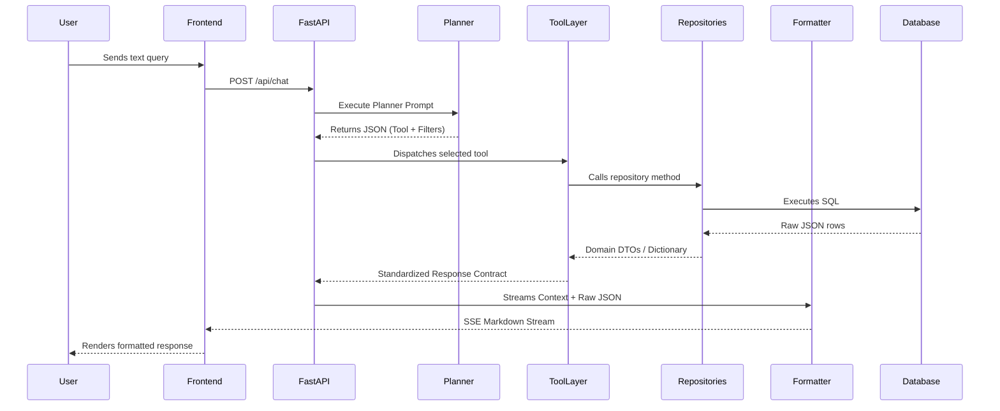
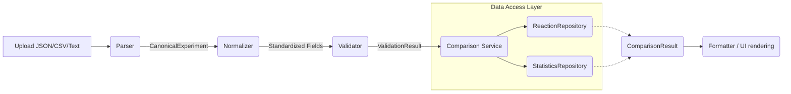
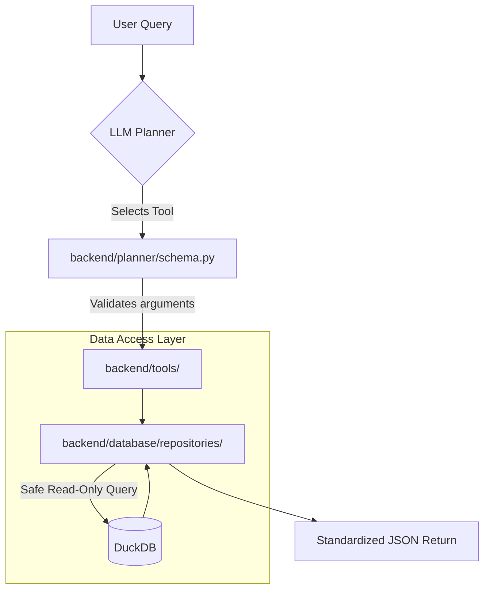
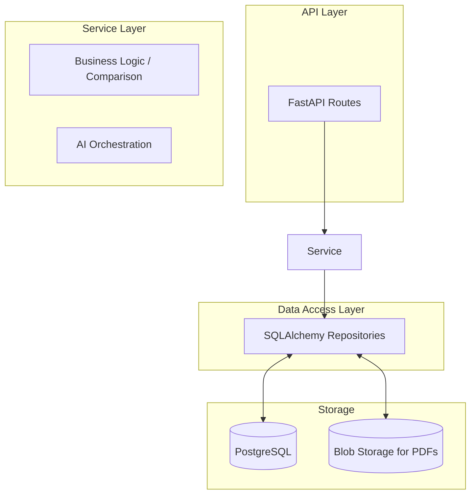

# System Architecture Diagrams

This document visualizes the architecture of the AI Chemistry Engine V1 following the completion of Phase 5.

## 1. Overall System Architecture

## 2. Chat Request Pipeline

## 3. Upload & Comparison Pipeline (Phase 5)

## 4. Planner → Tool → Database Flow

## 5. Future PostgreSQL Migration Architecture

