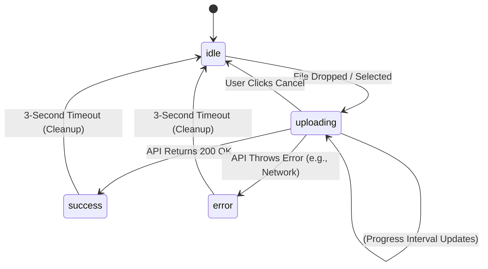

# Upload State Machine

This document outlines the frontend UI state transitions managed by `useUpload.ts` during an experiment upload.

## States

- **`idle`**: The initial state. The dropzone is available, and no files are actively being processed.
- **`uploading`**: A file has been selected and submitted to the API. The UI displays an active progress bar and parsing spinner.
- **`success`**: The API returned a successful parsing and comparison report. The UI transitions to a green checkmark indicating completion.
- **`error`**: The API returned a failure (e.g., network error or HTTP 500). The UI transitions to a red alert indicating failure.

## Transitions



## Lifecycle Cleanup Requirements

The lifecycle enforces that the upload preview (often referred to as the "toast") never hangs indefinitely.

```typescript
try {
  // Execute POST /experiments/compare
  const response = await uploadAndCompareExperiment(file);
  setUploadState("success");
  return response;
} catch (error) {
  // Capture API/Network exceptions
  setUploadState("error");
  return null;
} finally {
  // 3-Second Grace Period for UI Animation
  setTimeout(() => {
    setUploadState("idle");
    setUploadProgress(0);
    setUploadError(null);
    setUploadedFile(null);
  }, 3000);
}
```

This ensures that regardless of success or failure, the application returns to a clean slate, ready for the next upload interaction or normal conversational flow.
